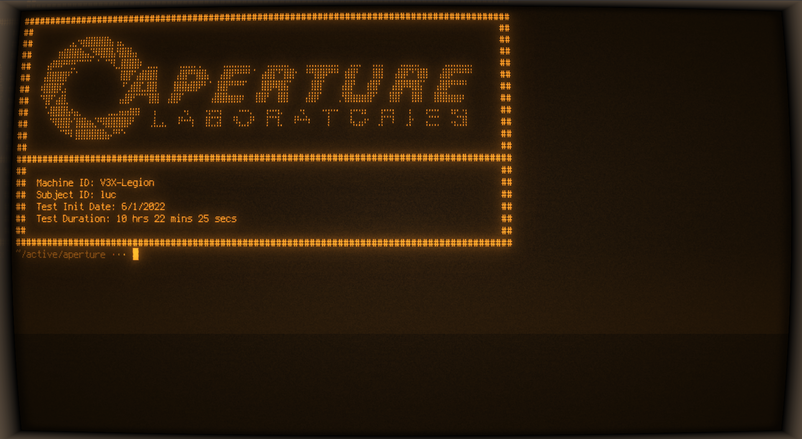

# Aperture

A small but still cute aperture science-themed banner.

The idea of this project came from trying out about [cool-retro-term](https://github.com/Swordfish90/cool-retro-term).
The default settings leave you with an amber retro terminal which sparked `aperture science` in my head.

Thus the following was created



## Prerequisites

- NodeJS installed somewhere on your machine.

Thats it.

## Installation

Install [cool-retro-term](https://github.com/Swordfish90/cool-retro-term). See [here](https://github.com/Swordfish90/cool-retro-term#install)

Clone the git repository:

```sh
git clone https://github.com/lucemans/aperture
```

Allow the `index.js` file to be executed

```
chmod +x ./index.js
```

Now simply run `index.js`, and you should be off to the races.

If you would like to take it up a notch add it to your `.bashrc` or `.zshrc` and use it as your banner.

## Profit